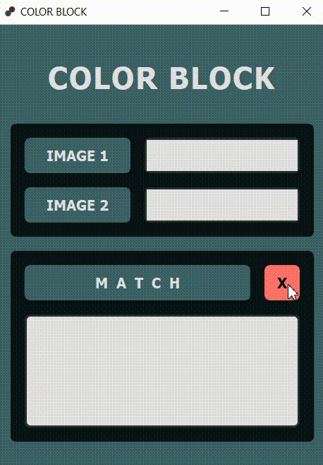

# _"Color Block"_ - Color Matching  
#### SBME_REHABColorBLock _(repo name)_  
---  

***Desktop APP***  

_**Short Description :**_ Mobile APP for color-matching of clothes targeted towards the colorblind  
---  

_**DEMO**_  
  
---  

* `code` folder contains *.py* files used for debugging  
* `misc` folder contains miscellaneous files used as input or saved output  
* `notebooks` folder contains *.ipynb* files used for debugging  
* `presentations` folder contains *.pptx* files used for presentations of project phases  
* `report` folder contains multiple reports for this project  
---  